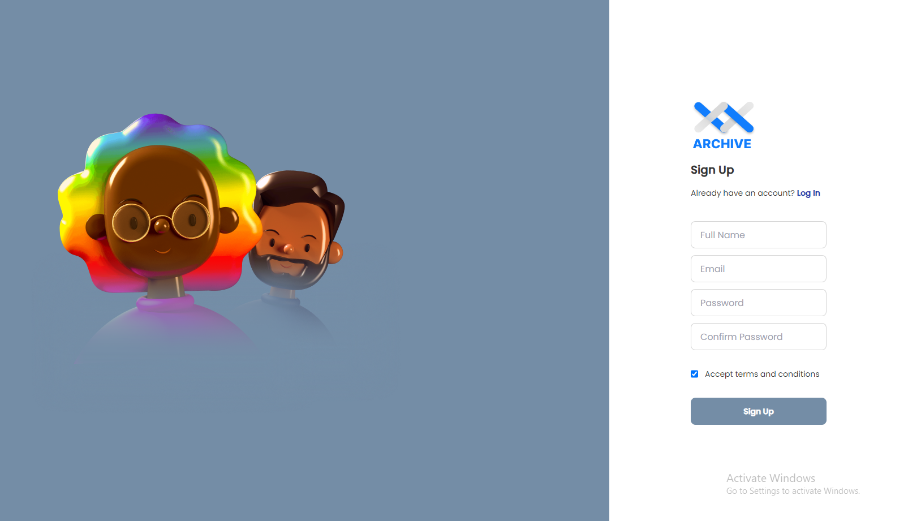

# Archive

#About The Project

Web application For Reservation tickets and Create events

# Feature

- Up-to-date and reliable Events Organizing
- Reservation events and create events
- And more

# Built with

<!-- - [fontend]() -->
1. [React js ](https://reactjs.org/)
2. [Tailwind](https://tailwindcss.com/)
3. [DaisyUi](https://daisyui.com/)

- [Backend](https://calm-rose-octopus-sari.cyclic.app/)
1. [Node js](https://nodejs.org/en/)
2. [Express js](https://expressjs.com/en/starter/installing.html)

# Tekno
- [Redux](https://redux.js.org/)
- [Axios](https://axios-http.com/docs/intro)
- [Argon](https://www.npmjs.com/package/argon2)
- [jwt token](https://www.npmjs.com/package/jsonwebtoken)
- [Multer](https://www.npmjs.com/package/multer)
- [Moment](https://momentjs.com/)
- [Formik](https://formik.org/)

# How to use

##Register Page

##Login Page

##Home Page

##Events Details

##Pofile Page

